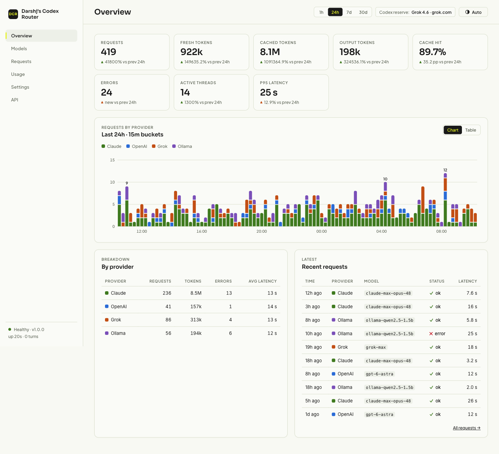
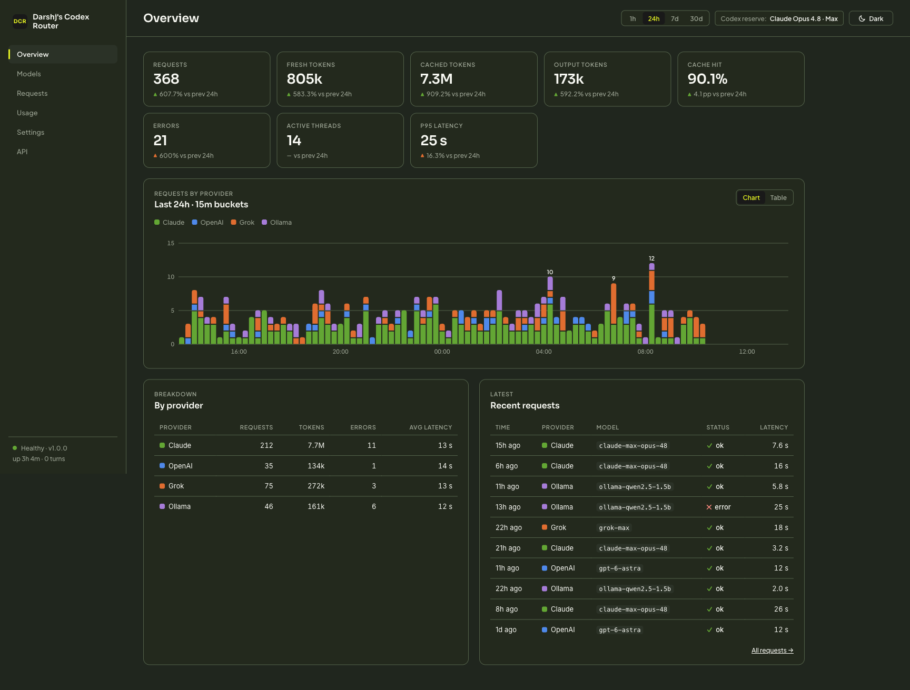
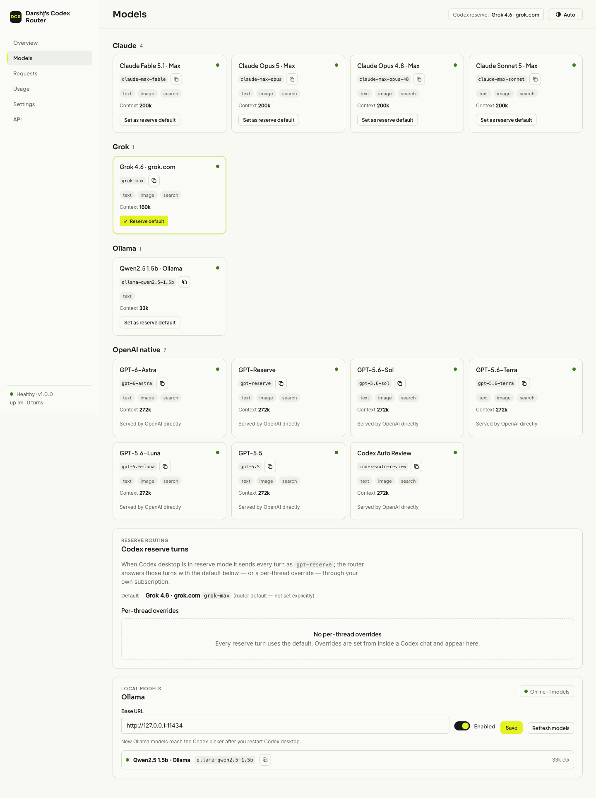
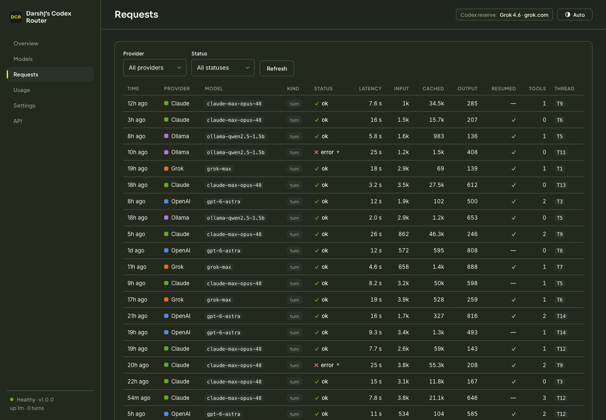
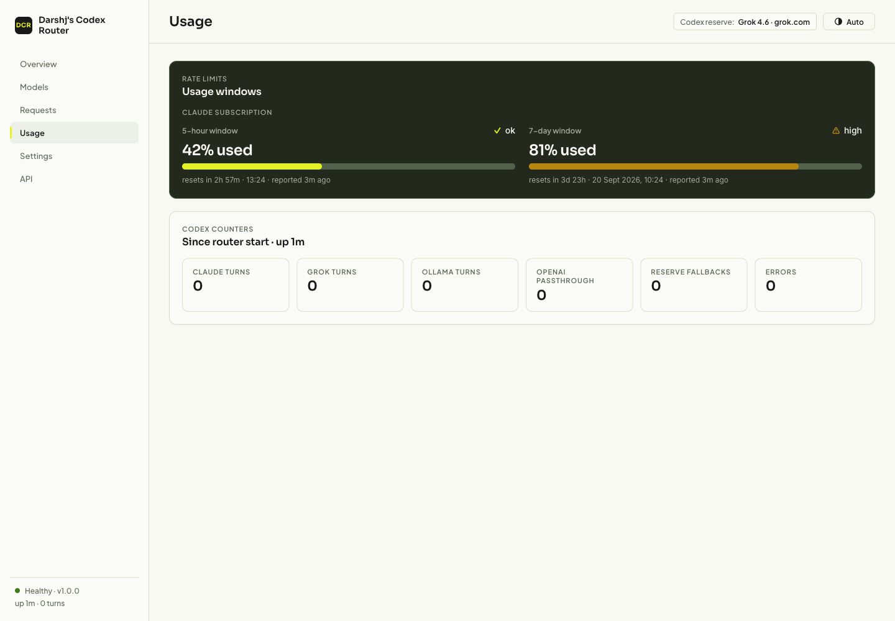

# Darshj's Codex Router

Every model you pay for, in one picker.

Darshj's Codex Router (DCR) is a small loopback service at `127.0.0.1:18740`
that puts Claude (your Claude Max login, through Claude Code), Grok (your
grok.com login, through Grok CLI) and local Ollama models into the Codex
desktop app's native model picker. Codex talks to the router the way it talks
to OpenAI. For the bridged entries the router drives the unmodified Claude Code
or Grok CLI binaries, or Ollama's HTTP API; everything else is forwarded to the
real ChatGPT Codex endpoint. A web dashboard at
`http://127.0.0.1:18740/dashboard/` shows what went where and what it cost in
tokens. The app binary is not patched and no login tokens are read: the only
changes on your machine are two keys in `~/.codex/config.toml` and a per-user
launchd service.

Contents: [Models](#models) · [Install](#install) · [Using it](#using-it) ·
[Dashboard](#dashboard) · [Ollama](#ollama) · [Token use](#token-use) ·
[Capabilities](#capabilities) · [Known limits](#known-limits) ·
[Security and privacy](#security-and-privacy) ·
[Rollback and uninstall](#rollback-and-uninstall) · [Development](#development) ·
[API reference](docs/API.md)

## Models

| Picker entry | Slug | Served by |
| --- | --- | --- |
| Claude Fable 5.1 · Max | `claude-max-fable` | Claude Code, model `claude-fable-5-1` |
| Claude Opus 5 · Max | `claude-max-opus` | Claude Code, model `claude-opus-5` |
| Claude Opus 4.8 · Max | `claude-max-opus-48` | Claude Code, model `claude-opus-4-8` |
| Claude Sonnet 5 · Max | `claude-max-sonnet` | Claude Code, model `claude-sonnet-5` |
| Grok 4.6 · grok.com | `grok-max` | Grok CLI, model `grok-4.6` |
| `<Model> · Ollama`, one per pulled model | `ollama-<name>`, e.g. `ollama-llama3.2-3b` | the local Ollama server |

The native GPT entries and the OpenAI provider stay exactly as they were, and
Astra remains the default. Claude model names are pinned rather than passed as
moving aliases, so the two Opus entries stay distinct over time.

## Install

Requirements:

- macOS with the Codex desktop app installed and opened once, so that
  `~/.codex/config.toml` exists.
- Python 3.9 or newer.
- Claude Code at `~/.local/bin/claude`, signed in to a Claude Max account
  (the router's `--claude` flag overrides the path).
- Optional: Grok CLI at `~/.local/bin/grok`, signed in to grok.com (`--grok`).
- Optional: Ollama at `http://127.0.0.1:11434` with at least one pulled model.

```sh
git clone https://github.com/darshjme/darshj-codex-router ~/repos/darshj-codex-router
cd ~/repos/darshj-codex-router
python3 -m venv .venv
.venv/bin/pip install -r requirements.txt
.venv/bin/python -m unittest -v test_router test_ollama test_dashboard_api
.venv/bin/python install.py install
```

Then fully quit Codex (Cmd-Q, not just the window) and reopen it. Codex reads
the model catalog file once, at app start.

`install.py install` does the following, in order, and stops at the first
problem without changing anything:

1. Checks that `.venv/bin/python`, `router.py` and `models.base.json` exist.
2. Refuses to continue if `~/.codex/config.toml` uses a custom
   `model_provider`, or if `openai_base_url` / `model_catalog_json` are already
   set to values it did not write itself.
3. Backs up `config.toml` once to `~/.codex/backups/darshj-codex-router/` and
   records what it is about to change in `state/installation.json`.
4. Writes `~/Library/LaunchAgents/ai.darshj.codex-router.plist`. The service
   runs `.venv/bin/python router.py --catalog state/models.json --base-catalog
   models.base.json --port 18740` with the checkout as working directory,
   `KeepAlive`, `RunAtLoad`, a 10 s throttle, and logs in `state/service.log`
   and `state/service-error.log`.
5. Stops and retires the previous `ai.darsh.codex-max-router` service if it is
   loaded (its plist is moved to `state/disabled-<label>-<timestamp>.plist`,
   not deleted), loads the new service, and waits for the health endpoint to
   answer `ok`. If it never does, the new service is unloaded, its plist is
   parked in `state/`, and the previous service is put back.
6. Only then sets the two keys: `openai_base_url = "http://127.0.0.1:18740"`
   and `model_catalog_json = "<checkout>/state/models.json"`.

Re-running `install.py install` is safe; it restarts the service and rewrites
the plist.

### Installer commands

| Command | What it does |
| --- | --- |
| `install.py install` | Install or restart the service and set the two Codex keys (above). |
| `install.py status` | Whether the service is loaded, the health JSON, catalog and token paths, and whether the config keys match. Exit code 1 if unhealthy. |
| `install.py token` | Print the dashboard token, creating `state/dashboard-token` (mode 0600) if missing. |
| `install.py migrate --from DIR` | Copy `reserve.json`, `settings.json`, `stats.sqlite` (with its WAL journal), `dashboard-token` and `installation.json` from another checkout into `state/`, never overwriting. |
| `install.py uninstall` | Restore the two keys, stop the service, keep source, state and backups. |

### Upgrading from Codex Max Router

If you renamed the old checkout in place, run `install.py install` from the
new path. The installer recognises the values it wrote earlier, retires the
old launchd label and re-points `model_catalog_json` at the generated
catalog. If the old checkout is a separate directory, stop it and carry its
state over first. The copied `installation.json` is what lets `install`
recognise the old config values as its own and upgrade them:

```sh
launchctl bootout gui/$(id -u)/ai.darsh.codex-max-router
.venv/bin/python install.py migrate --from ~/repos/codex-max-router
.venv/bin/python install.py install
```

## Using it

### Picker and effort

Start a fresh task in Codex and pick a Claude, Grok or Ollama entry from the
model picker. Codex's reasoning-effort slider works on the bridged entries:
the chosen level is passed to Claude Code and Grok CLI as `--effort`
(`low`, `medium`, `high`, `xhigh`, `max`; Codex's `none` and `minimal` map to
`low`, `ultra` maps to `max`). Turns without an effort leave the CLI's own
default in place. `xhigh` and `max` raise the Claude bridge timeout from four
to ten minutes; Grok turns always get ten.

### Reserve routing (Luna reserve)

When the ChatGPT account's advanced-model quota runs out, Codex desktop hides
its picker and sends every turn as `gpt-reserve`. The router serves those
turns with a bridged model of your choice instead of OpenAI's reserve model
and reports `gpt-reserve` back, so the app carries on. The pill still reads
"Luna reserve"; the first reserve turn of each thread says which model
actually answered.

Pick the model:

- Per thread: send `model: opus-48` in the chat. Aliases: `fable`, `opus`
  (Opus 5), `opus-48`, `sonnet`, `grok`, or any full slug. The router answers
  at once without calling a model and applies the choice to that thread's
  reserve turns; the thread's history and tool declarations are kept.
- Default for every thread: the dashboard's Models tab ("Set as reserve
  default"), or `PUT /api/v1/settings` (see [docs/API.md](docs/API.md)). If
  nothing is set, the router falls back to Codex's own `model` key in
  `~/.codex/config.toml` when it names a bridged model, and then to Claude
  Opus 4.8.

Choices persist in `state/reserve.json` (the last 256 per-thread overrides
are kept). Nothing in the app is patched; OpenAI's reserve model is simply
never called.

### Astra quota fallback

For native OpenAI models the router is a transparent relay, with one
exception: if Astra answers with an explicit quota-exhaustion error before
producing any output, that request is replayed to Claude Opus 5 with a note
saying so. Ordinary rate limits, authentication failures and failures after
partial output are passed through unchanged.

## Dashboard

Open <http://127.0.0.1:18740/dashboard/> (a bare `/` redirects there). The
first visit asks for the token:

```sh
.venv/bin/python install.py token      # or: cat ~/repos/darshj-codex-router/state/dashboard-token
```

A successful login sets an `HttpOnly`, `SameSite=Strict` cookie for 30 days.
Scripts use `Authorization: Bearer <token>` instead; every endpoint is in
[docs/API.md](docs/API.md).

Tabs:

- **Overview**: requests, fresh, cached and output tokens, cache hit %,
  errors, active threads and p95 latency for the selected range (1h, 24h, 7d
  or 30d), each with the delta against the previous equal period; a
  per-provider timeseries with a table view; a provider breakdown; the last
  ten requests.
- **Models**: every catalog entry grouped by provider (Claude, Grok, Ollama,
  OpenAI native) with slug, context window, modalities and an online dot;
  "Set as reserve default"; the per-thread reserve overrides with delete; the
  Ollama section with base URL, enabled toggle, Refresh and the model list.
- **Requests**: one row per turn with provider, model, kind (turn, compact,
  command, passthrough, checkpoint), status, latency, tokens in / cached /
  out, whether the CLI session was resumed, tool calls and a short thread id.
  Filters by provider and status, "Load more", and error rows expand to the
  error text.
- **Usage**: Claude's 5-hour and 7-day windows as meters (from the
  `rate_limit_event` each Claude turn reports), Codex counts, Grok and Ollama
  request counts, with relative and absolute reset times.
- **Settings**: rotate the token (shown once), theme, Ollama settings, the
  generated catalog path, and the reminder to restart Codex.
- **API**: the endpoint list with copyable `curl` lines.

The theme follows `prefers-color-scheme` and has a manual toggle (stored in
the browser as `dcr-theme`). No JavaScript is loaded from a CDN; fonts come
from Google Fonts with system fallbacks.

### Screenshots

| | |
| --- | --- |
|  |  |
|  |  |
|  | |

## Ollama

Ollama support is on by default and expects the server at
`http://127.0.0.1:11434`; both are changeable in Settings and persist in
`state/settings.json`. The base URL must point at `127.0.0.1` or `localhost`
(the API refuses anything else), so Ollama traffic never leaves the machine.

Discovery: when the service starts, and whenever you press Refresh in the
dashboard (or call `POST /api/v1/ollama/refresh`), the router asks Ollama for
its models (`GET /api/tags`, then `POST /api/show` per model for the context
length and whether it accepts images) and writes the combined catalog to
`state/models.json`: the tracked `models.base.json` plus one entry per Ollama
model. If Ollama is not running, the catalog is written without Ollama
entries and nothing fails.

Naming: `llama3.2:3b` becomes the slug `ollama-llama3.2-3b` and the picker
label `Llama3.2 3b · Ollama`. Slugs are lowercase `[a-z0-9.-]`.

After `ollama pull`, press Refresh, then fully quit and reopen Codex. Codex
reads the catalog file at app start, so a new model shows up in the picker
only after a restart; the dashboard says so after each refresh.

An Ollama turn sends the transcript as one system message plus one user
message to `POST /api/chat` with `stream: false`, a JSON schema for the reply
envelope, and `num_ctx` set to the model's context length capped at 32,768.
The catalog advertises the model's native context length (8,192 if unknown)
capped at 131,072, so Codex compacts long threads. Images are forwarded as
base64 to models that report vision. A reply that is not the expected JSON is
retried once with an explicit "return only the JSON object" message before
the turn fails with a bridge error.

Limits compared with the Claude and Grok entries:

- Stateless: every turn re-sends the full transcript. There is no session
  resume and no prompt cache, so the local model re-reads the whole thread
  each turn.
- No native tools inside Ollama: no web search (`supports_search_tool` is
  false), no Imagine, no CLI. Codex tools still work, because the model
  returns tool calls in the router's envelope and Codex executes them as
  usual.
- Nothing leaves the machine, except that an `http(s)` image URL mentioned in
  the conversation is fetched so Ollama receives bytes.

## Token use

Codex re-sends the whole thread on every sampling request, including one per
tool call. The router keeps that from costing a full upload each time:

- **One CLI session per Codex thread.** For Claude and Grok entries the
  router keeps one Claude Code or Grok CLI session per thread and, when a
  request continues the previous response, resumes it and sends only the new
  items. For Claude the rest of the transcript is then a prompt-cache read
  rather than a fresh upload. xAI did not report cache hits in testing, so on
  Grok the saving is the avoided re-upload of tool declarations and
  transcript rather than a cache discount. Tool declarations are sent once
  per session.
- **200k window.** Every Claude and Grok entry advertises a 200k context
  window, so Codex compacts long threads instead of growing them toward 1M
  tokens per turn. Compaction runs through the same bridge and produces a
  router checkpoint (see Capabilities).
- **Undeclared-tool correction.** If a turn names a tool that was not
  declared, the bridge corrects the model once inside the same session, for
  a few hundred tokens, instead of failing the turn and letting Codex retry
  from scratch.
- **Lost continuations.** CLI session ids are stored in `state/sessions.json`
  (last 256) so a router restart still resumes the same Grok or Claude
  session and only new items are sent. The expanded transcript cache stays
  in memory for two hours. If both the CLI session and that cache are gone,
  the router answers in OpenAI's own wire shape (`404`,
  `previous_response_not_found`) so Codex resends the full thread instead of
  failing after retries.
- **Pruning.** Bridge transcripts live under `~/.claude/projects/` and
  `~/.grok/sessions/` for the router's working directories and are deleted
  after 48 hours when the service starts, except Grok session directories
  still named in `sessions.json`.

The Requests tab shows tokens in / cached / out and a "resumed" flag per
turn, so you can see whether a thread is actually hitting the cache. Ollama
turns never resume (see above).

## Capabilities

Underneath: the catalog reaches Codex through its `model_catalog_json` option
and traffic through `openai_base_url`. Claude Code and Grok CLI run with their
own tools, plugins and MCP servers disabled and emit a structured
message/tool-call envelope; the router turns that into Responses events, and
**Codex executes the tools under Codex's own permissions**. The exceptions
are Grok Imagine and native web search/fetch when Codex declares search.

**Images.** Screenshots, pasted images and image tool results reach Claude
Code as native image blocks over `--input-format stream-json`. Each image is
replaced in the JSON transcript by a numbered `[image N]` placeholder so the
model can tell which message it belongs to. This is what makes computer use
and browser use work, since their tool results are screenshots. On Grok the
same images are also saved as files so `image_edit` and `image_to_video` can
use them.

**Voice.** Codex voice is OpenAI's own speech model, which delegates the
actual work to the thread's selected model. Its endpoints (the `/live` WebRTC
offer and the `/realtime` WebSocket) are relayed verbatim to the fixed
upstream, so voice works on a Claude thread and the work is done by Claude.

**Web search.** Codex's search backend (`/alpha/search`) is relayed to the
fixed upstream, so `web.run` keeps working on every model. When a request
declares a search tool directly instead, Claude Code's own `WebSearch` and
`WebFetch` (or Grok's `web_search` and `web_fetch`) are enabled for that call
only; all other tools still return to Codex for execution.

**Grok Imagine.** On `grok-max`, Grok CLI keeps `image_gen`, `image_edit`,
`image_to_video` and `reference_to_video`, so image and video generation uses
the signed-in grok.com Imagine account rather than OpenAI image tools. Stills
produced during the turn are copied into `state/grok-work/media/` and inlined
in the Codex turn (up to 4 MB each); videos are saved as files and linked by
absolute path. Video starts from an image: Grok generates a frame, then
animates it.

**Sub-agents, dynamic tools, skills, plugins, MCP.** These reach the model as
ordinary Codex tool declarations (including `additional_tools` added
mid-thread) and are executed by Codex under Codex's permissions. The bridge
allows four concurrent CLI calls and keeps 256 continuations for two hours so
a fan-out of sub-agents does not evict each other's context.

**Checkpoints.** When Codex compacts a bridged thread, the bridge writes a
summary and returns it as a marked, base64-encoded checkpoint in the Responses
protocol's `encrypted_content` field. These router checkpoints are **not
encrypted** and must not be mistaken for OpenAI-issued state. A thread
compacted while on an OpenAI model carries state only OpenAI can read; the
router asks the upstream once per checkpoint (first `gpt-6-astra`, then
`gpt-5.5`) for a plain-text handoff summary using the request's own
authorization, caches up to 64 of them in memory, and hands Claude a readable
checkpoint. If that conversion fails, Claude is told the earlier context is
unavailable rather than the turn failing.

**Usage headers.** Each Claude turn reports Claude Max usage: Claude Code
emits a `rate_limit_event` with the 5-hour and 7-day window utilisation and
reset times, and the router maps that onto the `x-codex-primary-*` (session)
and `x-codex-secondary-*` (weekly) used-percent / window-minutes / reset-at
headers Codex reads from each response, on both the HTTP and WebSocket paths.
The same numbers feed the dashboard's Usage tab. Codex's separate account
usage poll still goes to chatgpt.com and reflects the OpenAI account.

## Known limits

- Audio, video and file attachments are rejected with an explicit error; only
  text, images and tool results cross the bridge.
- Checkpoint conversion needs a working OpenAI model; without one, the
  visible messages are all Claude receives after an OpenAI-side compaction.
- Claude quota exhaustion surfaces as a bridge error with Claude's own
  wording. There is no automatic fallback from Claude to an OpenAI model.
- Bridged output is buffered until the CLI's structured turn completes. This
  adds latency and may use more quota than a direct CLI session.
- Native server-side OpenAI capabilities are not reimplemented on Claude,
  Grok or Ollama.
- Codex reads the catalog and endpoint at app start; restart it after
  installing, after Ollama models change, and after `uninstall`.
- The Astra fallback reacts to backend quota errors. It cannot override a
  desktop UI that blocks a request before sending it; pick a bridged model
  directly in that case.
- `models.base.json` is a snapshot of the native models present when it was
  generated. Revisit it after major Codex model updates.
- Claude Code may fall back to another model when its own guardrails refuse
  a request. The bridge reports the Codex slug that was selected; the Claude
  Code session record shows the model that actually answered.
- Grok CLI turns are capped at 12 internal tool rounds.

## Security and privacy

- **Loopback only.** The router binds `127.0.0.1`. Requests whose `Host` is
  not `127.0.0.1` or `localhost` get `403`, which also defeats DNS rebinding.
- **Origin checks.** Browser requests carrying an `Origin` header are only
  accepted from the router's own origin (`http://127.0.0.1:18740` or
  `http://localhost:18740`), and only for the dashboard and its API. Cookie
  sessions on the API additionally require a same-origin `Origin` or
  `Referer` (`403` otherwise); a request carrying neither header is allowed
  only if it is read-only (`GET`, `HEAD`, `OPTIONS`). Bearer requests are not
  origin-checked, since they carry the secret explicitly.
- **Dashboard token.** `state/dashboard-token` holds 32 random bytes as hex,
  mode 0600, created at first start or by `install.py token`. API bodies are
  capped at 64 KB. The login cookie
  is an HMAC of the token, `HttpOnly`, `SameSite=Strict`, valid for 30 days.
  Ten failed logins within ten minutes lock login for that process (`429`).
  Rotating the token (Settings, or `POST /api/v1/auth/rotate`) invalidates
  every existing session, because the cookie is derived from the token.
- **No credentials read.** Claude Code and Grok CLI use their own logins; the
  router never reads, copies or stores them. `ANTHROPIC_*`, `CLAUDE_CODE_*`,
  `XAI_API_KEY` and `GROK_CODE_XAI_API_KEY` are stripped from the bridge
  subprocess environment so an API key is never billed by accident. Codex's
  own `Authorization` header is forwarded only to the fixed upstream
  `https://chatgpt.com/backend-api/codex` on a bounded set of paths; the
  router is not a general proxy.
- **No prompt logging.** The router keeps no access log and writes no prompts
  to disk itself. Claude Code and Grok CLI keep their usual local session
  transcripts for resumed threads (pruned after 48 hours). The stats store
  holds metadata only: no prompts, no outputs. Its `prune` routine deletes
  rows older than 90 days but is not yet called by the service.
- **Router checkpoints are not encrypted.** They are marked base64 summaries
  in the `encrypted_content` field and live only as long as Codex keeps them.

What is stored where:

| Path | Contents | Retention |
| --- | --- | --- |
| `state/` (mode 0700, gitignored) | everything below | |
| `state/reserve.json` | reserve model default and per-thread overrides | last 256 overrides |
| `state/settings.json` | Ollama enabled flag and base URL | until changed |
| `state/stats.sqlite` | per-request metadata (time, thread id, model, provider, kind, status, error text, latency, token counts, resumed flag, tool-call count), events, Claude usage windows | `Stats.prune(keep_days=90)` exists; 1.0.0 does not schedule it yet, so rows are kept until it is wired in |
| `state/dashboard-token` | the dashboard token (0600) | until rotated |
| `state/models.json` | the generated catalog Codex reads | rewritten at start and on refresh |
| `state/installation.json` | what the installer changed and where the config backup is | kept across uninstall |
| `state/claude-work/`, `state/grok-work/` | CLI working directories; Grok Imagine output under `grok-work/media/` | manual |
| `state/service.log`, `state/service-error.log` | launchd stdout and stderr | manual |
| `~/.claude/projects/…`, `~/.grok/sessions/…` | CLI session transcripts for the router's working directories | 48 hours |
| `~/.codex/backups/darshj-codex-router/` | the original `config.toml` | until you delete it |
| `state/sessions.json` | Codex response id → CLI session id + model | last 256, survives restart |
| process memory | expanded transcript cache (2 h), 64 checkpoint summaries | service lifetime |

## Rollback and uninstall

```sh
.venv/bin/python install.py uninstall
```

This puts `openai_base_url` and `model_catalog_json` back to what they were
(removing them if they were unset), refuses if either key was changed by
something else since install, unloads `ai.darshj.codex-router` and moves its
plist to `state/disabled-ai.darshj.codex-router-<timestamp>.plist`. Source,
`state/` and the config backup stay on disk. Fully quit and reopen Codex
afterwards.

Manual runbook, if the installer itself is unavailable:

1. `launchctl bootout gui/$(id -u)/ai.darshj.codex-router`
2. Remove the two keys from `~/.codex/config.toml`, or restore the backup
   named in `state/installation.json` (`install.py status` prints it).
3. Fully quit and reopen Codex.

To bring back the previous Codex Max Router service instead, move its plist
from `state/disabled-ai.darsh.codex-max-router-<timestamp>.plist` back to
`~/Library/LaunchAgents/` and run `launchctl bootstrap gui/$(id -u) <plist>`.

## Development

```
router.py          loopback Responses router: routing, sessions, reserve, checkpoints, passthrough
adapter.py         Claude Code / Grok CLI bridges: envelope, images, effort, usage headers
ollama.py          Ollama discovery, catalog entries and turns
stats.py           SQLite stats store (state/stats.sqlite)
dashboard_api.py   /api/v1 and /dashboard aiohttp sub-apps
dashboard/         index.html, app.js, styles.css (no framework, no CDN JS)
models.base.json   tracked catalog: native Codex snapshot + Claude and Grok entries
install.py         install, status, token, migrate, uninstall
docs/API.md        dashboard API reference
```

Tests are per module and use the standard library runner:

```sh
.venv/bin/python -m unittest -v test_router          # routing, bridges, reserve, checkpoints (51 tests)
.venv/bin/python -m unittest -v test_ollama          # discovery, slugs, turns against a fake Ollama
.venv/bin/python -m unittest -v test_dashboard_api   # auth, every endpoint, static serving
```

To run a second router by hand without touching the installed service or its
state, use another port and state directory:

```sh
.venv/bin/python router.py --catalog /tmp/dcr-dev/models.json --base-catalog models.base.json \
  --state /tmp/dcr-dev --port 18741
```

Dependencies are pinned in `requirements.txt` (aiohttp, zstandard, tomlkit,
backports.zstd). There is no CI: GitHub Actions are disabled on this
repository by policy, so run the tests locally before pushing.

Prior art: [duolahypercho/codex-router](https://github.com/duolahypercho/codex-router)
was inspected, not used. It keeps subscription bridges out of the picker and
offers API-key Claude models separately; this router's point is the native
picker over your own signed-in CLIs.

## License

MIT. See [LICENSE](LICENSE).
